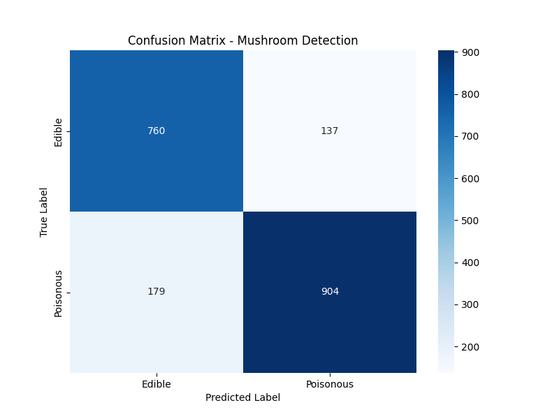

# 🍄 Mushroom Detection System using Deep Learning

This project focuses on detecting whether a mushroom is **Edible** or **Poisonous** using image processing and Deep Learning techniques.

## 🚀 Features
- **Model:** Transfer Learning with **Xception** architecture.
- **Accuracy:** %84 Test Accuracy / %99 Single Image Confidence.
- **Mobile Ready:** Converted to `.tflite` for React Native integration.
- **Data Augmentation:** Applied rotation, zoom, and shift to improve generalization.

## 📂 Project Structure
- `train_model.py`: Main training script using Xception.
- `evaluate_model.py`: Generates Confusion Matrix and Classification Report.
- `predict.py`: Tests the model on a single image.
- `convert_to_tflite.py`: Converts the Keras model to TFLite for mobile apps.
- `best_mushroom_model.keras`: The trained high-accuracy model.

## 📊 Performance
The model was trained on a balanced dataset and evaluated using a separate test set.


## 🛠️ Installation & Usage
1. Clone the repo:
   ```bash
   git clone [https://github.com/YOUR_USERNAME/Mushroom-Detection.git](https://github.com/YOUR_USERNAME/Mushroom-Detection.git)